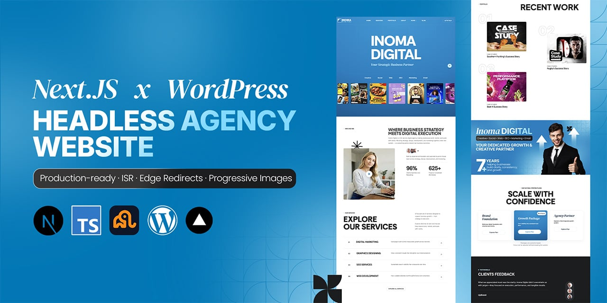
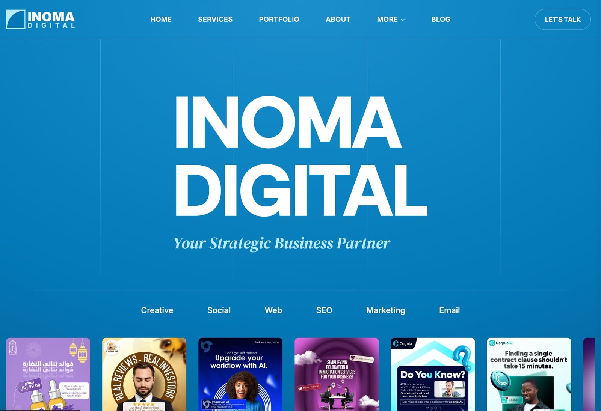
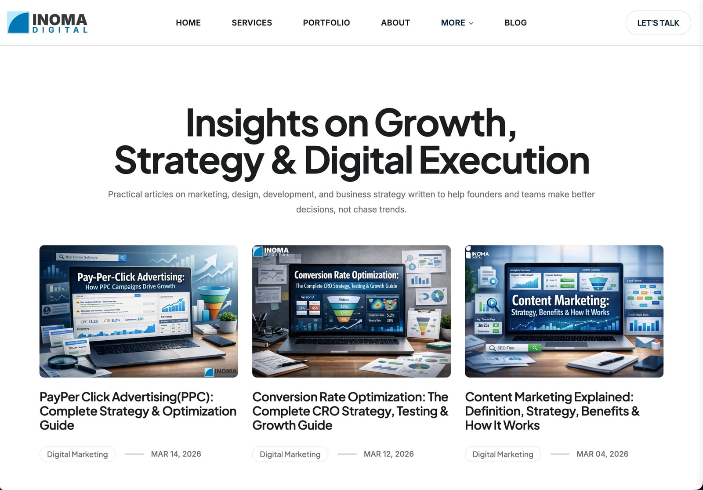
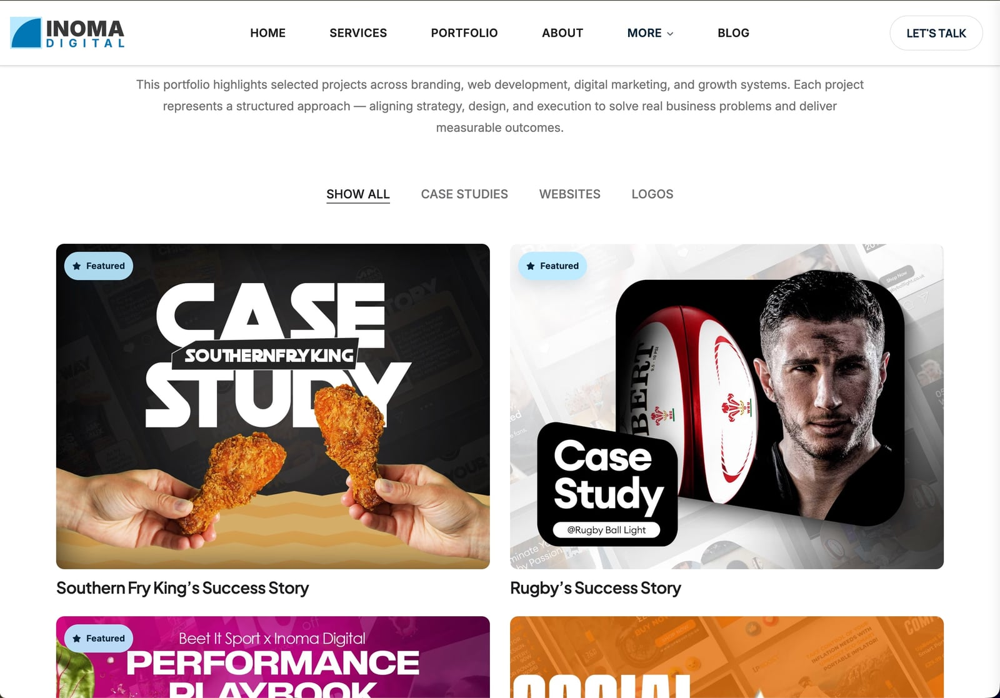
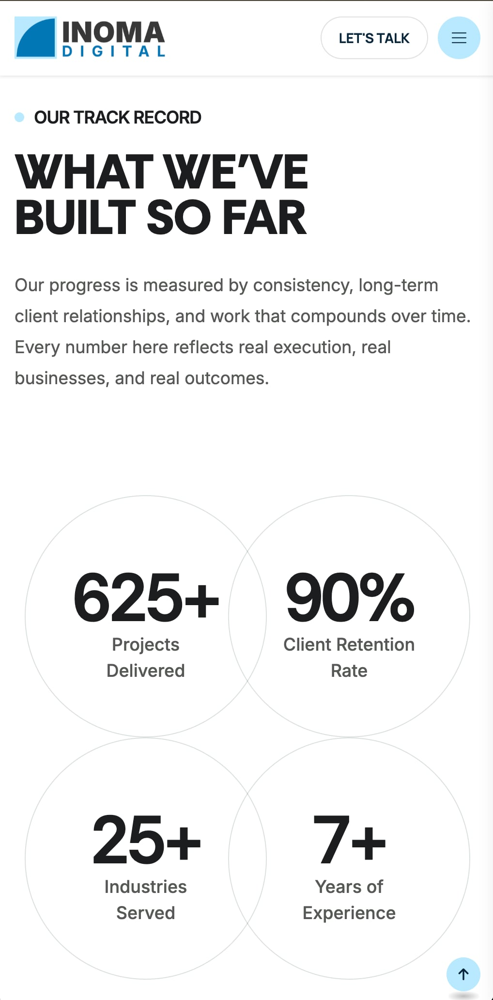

# Next.js Headless WordPress Agency Website

A production-ready agency website built with Next.js 16 App Router and headless WordPress via WPGraphQL. Built for digital agencies that need non-technical content teams to manage SEO, blog, portfolio, and redirects — while keeping full frontend control in Next.js.

## Live Demo

[https://inomadigital.com](https://inomadigital.com)

## Screenshots



### Desktop





### Mobile

<table>
  <tr>
    <td></td>
    <td></td>
  </tr>
</table>

---

## What Makes This Different

### Progressive Portfolio Image Loading
The most technically distinctive feature of this project. Large portfolio images are fetched from WordPress, split into horizontal slices server-side using Sharp, and streamed to the client progressively — each slice loads independently and stitches together as it arrives. This solves a real problem: agency portfolio images are often very tall composite images (3000–8000px) that would block render if loaded as a single file. The slicing pipeline runs at request time via a dedicated API route, with slice dimensions calculated dynamically based on the image aspect ratio.

Key files: `src/app/api/img/slice/route.ts`, `src/components/pages/portfolio/PortfolioLongImage.tsx`

### WordPress-Driven Redirects at the Edge
SEO-safe URL changes without code deploys. A custom WordPress REST endpoint stores redirect rules in the CMS. Next.js middleware fetches these rules at the Edge on every request and applies them before the page renders — meaning marketing and SEO teams can manage 301 redirects directly from WordPress admin, with no developer involvement and no redeployment required.

Key file: `src/middleware.ts`

### Yoast SEO → Next.js Metadata Pipeline
Every page's `<title>`, `<meta description>`, Open Graph tags, canonical URLs, and robots directives are sourced from Yoast SEO in WordPress via WPGraphQL. The GraphQL query fetches the full Yoast `seo` object and maps it directly to Next.js `generateMetadata()`. This means SEO teams get full Yoast tooling — previews, readability scores, keyword analysis — and the output flows automatically into the Next.js metadata system without any manual duplication.

Key file: `src/lib/wp.ts` — `buildQueryWithSeo()`, `mapSeoToMetadata()`

### ISR with 5-Minute Revalidation
All data-fetching pages use `export const revalidate = 300`. Pages are statically generated at build time and automatically regenerated in the background every 5 minutes. Users always get a cached response at CDN speed; content updates from WordPress appear within 5 minutes without any manual cache clearing or redeployment.

### PurgeCSS + CSSO Post-Build Pipeline
Bootstrap 5 ships ~200KB of CSS. The `postbuild` script runs PurgeCSS against all rendered HTML and TSX files, removing every unused selector, then pipes the result through CSSO for minification and structure optimization. The result is a fraction of the original Bootstrap bundle — only the classes actually used in the project survive to production.

---

## Features

- [x] Dynamic blog with cursor-based WPGraphQL pagination
- [x] Progressive portfolio image slicing and streaming
- [x] WordPress-driven 301 redirects at the Edge
- [x] Yoast SEO → Next.js metadata pipeline (title, description, OG, canonical, robots)
- [x] ISR with 5-minute revalidation across all pages
- [x] Contact form via Resend
- [x] Privacy policy page sourced from WordPress
- [x] Automatic XML sitemap with dynamic blog and portfolio entries
- [x] Google Tag Manager (server-side env var, zero client exposure)
- [x] PurgeCSS + CSSO post-build CSS optimization
- [x] Clash Display variable font (self-hosted)
- [x] Bootstrap 5 grid with custom SCSS design system
- [x] Mobile-responsive across all pages

---

## Architecture

```
Next.js 16 App Router (TypeScript)
├── WordPress CMS (WPGraphQL + Yoast SEO + CPT UI)
├── ISR revalidation (5 min) on all data pages
├── Edge middleware for WordPress-driven redirects
├── Sharp image pipeline for portfolio slice streaming
├── Resend for transactional email
├── PurgeCSS + CSSO in postbuild
└── Vercel deployment
```

---

## Project Structure

```
src/
  app/              # Pages, layouts, API routes
  components/       # React components
  lib/              # wp.ts (data fetching), utils.ts (shared helpers)
  styles/           # SCSS source
  data/             # Static data (menus, services)
  hooks/            # Custom React hooks
public/
  assets/           # CSS, fonts, images
docs/               # SEO guidelines, CMS audit, performance notes
```

---

## WordPress Requirements

**Plugins required:**
- WPGraphQL
- WPGraphQL for Yoast SEO
- Custom Post Type UI (Portfolio CPT with excerpt support enabled)
- A custom REST endpoint at `/wp-json/[namespace]/v1/redirects` returning redirect rules

**Portfolio CPT must support:**
- Title, content, excerpt, featured image
- Taxonomies for categories
- ACF fields (optional — field names configurable via env vars)

---

## Getting Started

1. Clone the repository
2. Copy `.env.example` to `.env.local` and fill in all required values
3. Set up WordPress with the required plugins listed above
4. Create the Portfolio custom post type in CPT UI with excerpt support enabled
5. Run `npm install`
6. Run `npm run dev`

See `.env.example` for all environment variables with descriptions.

---

## Deployment

Optimized for Vercel. Set all environment variables in your Vercel project dashboard. The `postbuild` script (PurgeCSS + CSSO) runs automatically on every Vercel build.

**Required Vercel environment variables:**
- `WP_GRAPHQL_ENDPOINT`
- `WP_MEDIA_DOMAIN`
- `SITE_URL`
- `RESEND_API_KEY`
- `CONTACT_TO_EMAIL`
- `CONTACT_FROM_EMAIL`
- `GTM_ID`
- `WP_REDIRECTS_API_URL`

---

## Tech Stack

| Technology | Purpose |
|---|---|
| Next.js 16 | App Router, ISR, API routes, Edge middleware |
| TypeScript | Type safety throughout |
| WordPress | Headless CMS — content, SEO, redirects |
| WPGraphQL | Typed GraphQL API for WordPress data |
| Yoast SEO | SEO metadata managed in WordPress |
| Sharp | Server-side image slicing for portfolio |
| Bootstrap 5 | Responsive grid and base components |
| SCSS | Custom design system on top of Bootstrap |
| Resend | Transactional email for contact form |
| PurgeCSS + CSSO | Production CSS optimization |
| Vercel | Deployment and Edge runtime |

---

## Docs

The `docs/` folder contains architecture and maintenance documentation:
- `ARCHITECTURE.md` — CMS request flow, routing audit, performance notes
- `SEO.md` — SEO guidelines, maintenance guide, technical SEO decisions
- `ANALYTICS.md` — GTM setup and analytics audit

---

## License

MIT